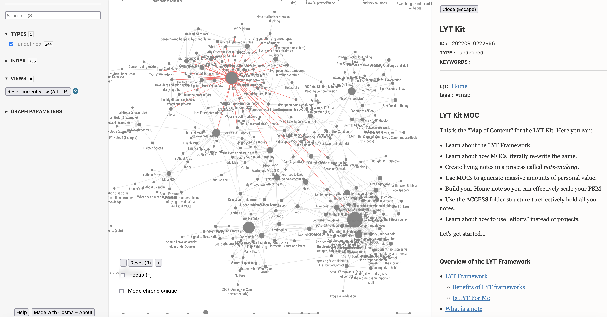

# Obsidian2cosma

Language: English | [中文]()

This repository is forked from [kevinpolisano/obsidian2cosma](https://github.com/kevinpolisano/obsidian2cosma). It has more features and enhancements on this version:

* Rewrite the function of YAML-parser. Now it can parse [more formats](#Parser of YAML) of YAML front-matter no matter what the key's name is.
* Rewrite the logic of creating IDs and provide options. See [this option](#`--method METHOD`).
* An optional function to change keys' name in the front-matter. See [this option](#`--attrreplacement ATTRIBUTEPAIRS`).
* Fix bugs that occur when copying the creation date of source file to destination file on Windows. 
* Enhancement on processing when it works on Windows.
* Enhancement on interaction when it was used regularly and frequently. See [this option](#`--force`).
* Support the use of UTF-8 charset which means that more languages can be used in files' titles, front-matters and contexts instead of English only.
* Update README.md and add a Chinese version of that.

## Description

### Obsidian

[Obsidian](https://obsidian.md/) is a popular Markdown note-taking application in the field of Personal Knowledge Management (PKM), with a big community support and plenty of third-party open source plugins. Obsidian editor is free to use but is not open source. It has some premium features, like syncing and publishing notes online. [Obsidian Publish](https://obsidian.md/publish) is one of these premium features, enabling to share the amazing graph view of the (bidirectional) links between notes. 

### Cosma

[Cosma](https://cosma.graphlab.fr/en/) is an [open source app](https://github.com/graphlab-fr/cosma) which can generate such a graph view, from a directory of text files written in Markdown, in a single HTML file called the **cosmoscope**. It offers a simple way to explore, visualize and share your knowledge graph with others. *Software comes and goes, but data should last*. Plain text are **future-proof**, hence the importance of not making your notes too dependent on a particular software syntax and of being able to migrate them easily.

## A Python script to convert Obsidian vault toward Cosma or Zettlr

- Cosma uses the same syntax as [Zettlr](https://zettlr.com), another great editor geared towards academic work, whose `[[internal links]]` relies on unique identifiers `[[id]]`, in the spirit of the [Zettelkasten method](https://docs.zettlr.com/en/academic/zkn-method/).
- Obsidian is different, as it uses the `[[filename]]` to link note files, which in my opinion is more restrictive in terms of **interoperability**. 

There are at least two good reasons to convert a collection of Markdown files written in Obsidian to make it compatible with Cosma:
- To ensure that your notes will still be readable and editable by other software such as Zettlr (for interoperability and future-proof)
- To be able to **export and share all or part of your knowledge graph with Cosma**, in the form of a single HTML page, simultaneously displaying the notes on the one hand and the graph view on the other.

In practise, the script follows these steps:
1. **Copy files** of your Obsidian vault (input folder) into another directory (output folder) to avoid accidental changes or losses. Folders starting with `_` are ignored.
2. *(Optional)* **Filter Markdown files** in the output folder according to particular type or tags. (You can also edit the configuration file of Cosma to do this. See [user-manual-of-cosma](https://cosma.arthurperret.fr/user-manual.html).)
3. **Create metadata fields** `id` and `title` for each Markdown file where they were missing
4. **Save a CSV file** containing associated pairs `(id, title)` to preserve the correspondence
5. **Replace all wiki-links** `[[filename]]` used in Obsidian to [Zettlr syntax with identifiers](https://docs.zettlr.com/en/academic/zkn-method/) if `--zettlr=True` or (by default) to [Cosma syntax](https://cosma.graphlab.fr/en/docs/cli/user-manual/#links), mixing [Zettlr syntax](https://docs.zettlr.com/en/academic/zkn-method/) and [Obsidian style using alias](https://help.obsidian.md/How+to/Add+aliases+to+note), namely `[[id|alias]]`
6. *(Optional)* **Replace Obsidian typed links** using [Juggl syntax](https://juggl.io/Link+Types) `- prefix [[link]]` to the more flexible syntax of [semantic links in Cosma](https://cosma.graphlab.fr/en/docs/cli/user-manual/#links) `[[prefix:link]]`

## Installation

- **Download** the Python script
- **Install packages** required: os, platform, argparse, Path, datetime, re, shutil, csv, unicodedata

## Usage

 ```bash
 python obsidian2cosma.py -i input_folder_path -o output_folder_path
                                 [--type TYPE] [--tags TAGS]
                                 [--typedlinks TYPEDLINKS] 
 								[--semanticsection SEMANTICSECTION]
                                 [--method METHOD]
                                 [--attrreplacement ATTRIBUTEPAIR1[, ATTRIBUTEPAIR2 ...]]
                                 [--zettlr ZETTLR]
                                 [-f] [--ignore] [--verbose]
 ```

```
Optional arguments:
  -h, --help                            Show this help message and exit
  --type TYPE                           Select notes with type TYPE (e.g --type "article")
  --tags TAGS                           Select notes with tags TAGS (e.g --tags "philosophy truth")
  --typedlinks TYPEDLINKS               Syntax of typed links modified if TYPEDLINKS=True (e.g --typedlinks True)
  --semanticsection SEMANTICSECTION     Specify in which section typed links are (e.g --semanticsection "## Typed links")
  --method METHOD                       Fill the ID with the specified Method (e.g --METHOD ctime).
                                        Fill the ID with file creation date if METHOD=ctime (Not recommended),
                                        or with attribute 'abbrlink' in front-matter if METHOD=abbrlink.
  --attrreplacement ATTRIBUTEPAIRS      Rename front-matter attributes of a record. (e.g --attrreplacement categories,types).
                                        Use a comma to separate two attributes in a pair.
                                        And you can type attribute pairs as many as you want.
                                        Spaces cannot exist in an attribute pair, but can be used between pairs.
  --ignore                              Don't copy the creation time when copying files from the source directory.
                                        If the method to fill the ID by ctime was designated, this option will be invalid.
  -f, --force                           Force overwrite output directory if it already exists.
  --zettlr ZETTLR                       Use Zettlr syntax for wiki-links if ZETTLR=True (e.g --zettlr True)
  -v, --verbose                         Print changes in the terminal
```

##### `--method METHOD`

In Cosma, each record should have a unique identifier. Must be a unique number. If `id` is not found in the front matter, the script will create one automatically. 

* By default, the script will generate ordered numbers as records' ID.
* If `--method ctime`, the script generates 14-digit identifiers in the form of a timestamp (year, month, day, hours, minutes and seconds). It will force to copy creation time when copying files to output folder. It's **Not recommended** to use this option, not only because it is time-consuming on Windows but also due to the occurrence of unexpected conditions when more than one file has the same creation time, which usually happens. 
* if `--method abbrlink`, the script will use `abbrlink` as the record's identifiers. This feature is inspired by [rozbo/hexo-abbrlink](https://github.com/rozbo/hexo-abbrlink). It's assumed that `abbrlink` is hexadecimal string, the script just converts it to integer as the ID of a record. If `abbrlink` is not found in the front matter, the script will create one by using crc32 algorithm whose source string is `title` to get `abbrlink`.

##### `--attrreplacement ATTRIBUTEPAIRS`

This script provides an optional function to change `ATTRIBUTE`s' name in the front matter. For example, `--attrreplacement categories,types` will change the attribute name '`categories`' to '`types`'. You can also use `--attrreplacement oldname1,newname1 oldname2,newname2 ...` to change more names.

##### `--ignore`

The script will not copy creation time when copying files from source folder to target folder. It will save time on Windows.

##### `--force`

If the output folder is exists, the script will not work by default. Use `--force` to let it run whether the output folder exists or not.

## Examples

In the directory `example/` you will find an example of Obsidian vault called [LYT-Kit](https://www.linkingyourthinking.com/download-lyt-kit).

### `obsidian2cosma` converts `LYT-Kit/` to `LYT-Kit-cosma/`

At the folder root run the Python script:

```bash
python3 obsidian2cosma.py -i example/LYT-Kit -o example/LYT-Kit-cosma --method ctime --verbose
```

This creates a new folder `LYT-Kit-cosma/` whose Markdown files have their **internal links transformed** as follows:
- `[[filename]]` are replaced by `[[id|filename]]` 
- `[[filename|alias]]` are replaced by `[[id|alias]]`

where `id` is the identifier of the file `filename.md`, that is `title2id["filename"]="id"` with dictionary `title2id` saved in the CSV file `title2id.csv`.

The next step is to use `cosma` to **generate a graph view** of your notes which can be export in a single HTML file.

Once you have installed [Cosma CLI v.2.0.2](https://cosma.arthurperret.fr/installing.html) go to the output folder and initialize the config file:

```bash
cd example/LYT-Kit-cosma
cosma c
```

It creates a `config.yml` file in which you have to fill the second field with the absolute path of the output folder:

```bash
files_origin: '/path_to_obsidian2cosma/example/LYT-Kit-cosma'
```

Finally, let us create the `cosmoscope.html` by running:

```bash
cosma m
```



### `obsidian2cosma --zettlr True` converts `LYT-Kit/` to `LYT-Kit-zettlr/`

At the folder root run the Python script:

```bash
python3 obsidian2cosma.py -i example/LYT-Kit -o example/LYT-Kit-zettlr --method ctime --zettlr True --verbose
```

This creates a new folder `LYT-Kit-zettlr/` whose Markdown files have their **internal links transformed** as follows:
- `[[filename]]` are replaced by `[filename]([[id]])` 
- `[[filename|alias]]` are replaced by `[alias]([[id]])` 

These files are now readable by [Zettlr](https://docs.zettlr.com/fr/academic/zkn-method/).

## Issues

Known bugs in Cosma:
- Chronological mode does not work as expected.

## Related repository

`òbsidian2cosma` converts an Obsidian vault into a collection of Markdown files readable by Cosma and Zettlr. Conversely, it is possible to implement a script `zettlr2obsidian`: [Conversion tool to make Zettlr markdown files be visible in Graph Mode in Obsidian](https://gist.github.com/KarlClinckspoor/4ec995fd506ec6483b8e02d8afc388fc/raw/c787747da28d97080c64077352ec6d41e80ae6f5/conversion.py)

## More information

### Parser of YAML

Why not use other YAML modules? Using fewer other third-party modules can make this script simple and easy to use. In most cases, the front-matter in our articles is not too complex.

What parts of the YAML specifications does it support? It supports:

* Simple key/value pair. Examples:

  ```yaml
  time: 20:03:20
  utf8-str: Je m’appelle 小明
  link: https://yaml.org/spec/1.2.2/#chapter-2-language-overview
  ```

* List in Flow Styles. Examples:

  ```yaml
  tags: [un, deux, trois]
  ```

* List in Block Styles. Examples:

  ```yaml
  tags:
    - un
    - deux
    - trois
  ```

  It finally converts to `tags: [un, deux, trois]` in output file.

* Line Folding. Examples:

  ```yaml
  cover: >-
    https://yaml.org/spec/1.2.2/#a-long-long-long-long-link
  ```

You can add new issues to let us know which formats should be recognized or submit a pull request (PR).

### Contect

Editor of This version: Wanqin Wu (wuanqin@mail.ustc.edu.cn)
Original Author: Kévin Polisano (kevin.polisano@cnrs.fr)

### Licence

GPLv3
