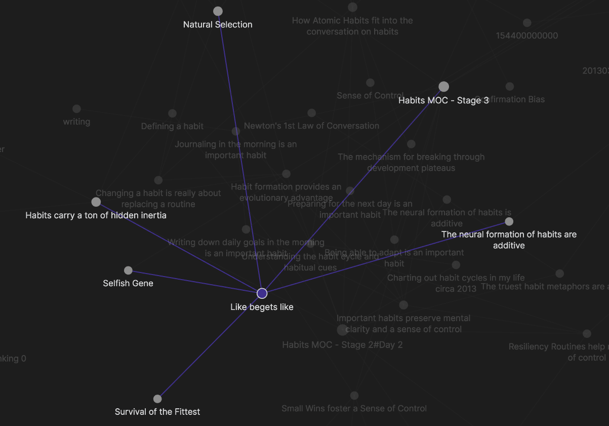

up:: [Evergreen notes]([[20220828192537]])
tags:: #on/PKM 

# Evergreen notes are things or statements about things
Many evergreen notes should be statements with a clear opinion. That's because it forces you to really think about what you're trying to say. However, these "clear opinions" need "clear things" to talk about! What are these "things"?

"THINGS" like:
- *Concepts*: which can and should stand on their own
- *Known Things*: "The magna carta was signed in 1215"
- *Standards*: Things with a pre-set language (whether that's programming, Things that follow a process, manuals, etc
	- examples include anything from mathematical formulas, to the basics of language, to the process of putting a bike together
- *Definitions, terms, topics, persons, places, or generally any other nouns.

These THING-based notes will naturally spawn ideas of your own that have clear opinions (or statements). For example:
- The note on the `[[Magna Carta]]` (Clear Thing) can then link to a personalized note titled `[[No one is above the law]]` (Clear Opinion), which could link to another note titled `[[Protests can invoke radical change]]` (Clear Opinion).
- A note on `[[Defining a variable]]` (Clear Thing) can link to a personalized note on `[[Understanding variables leads to higher level thinking]]` (Clear Opinion).
- A note on the concept `[Like begets like]([[20220829215344]])` (kinda both Clear Opinion and Fact) can link to the opinion `[[The neural formation of habits are additive]]` (Clear Opinion) and a bunch of other notes. See this example below:

In this way, Thing-based notes are sturdy dots that we can then connect to Opinion-based notes through the natural process of note-making.

This is one of my [Strong opinions, weakly held]([[20220829215637]]).

---
### Extra commentary
There seem to be "things" and "opinion about things", and it's nice to have both. The "things" act as pillars of—or waypoints to—acquired knowledge. Guiding markers and reminders. The things are the latticework upon which our "opinions about things" can hang. I suspect a healthy PKM system needs a balance of both.